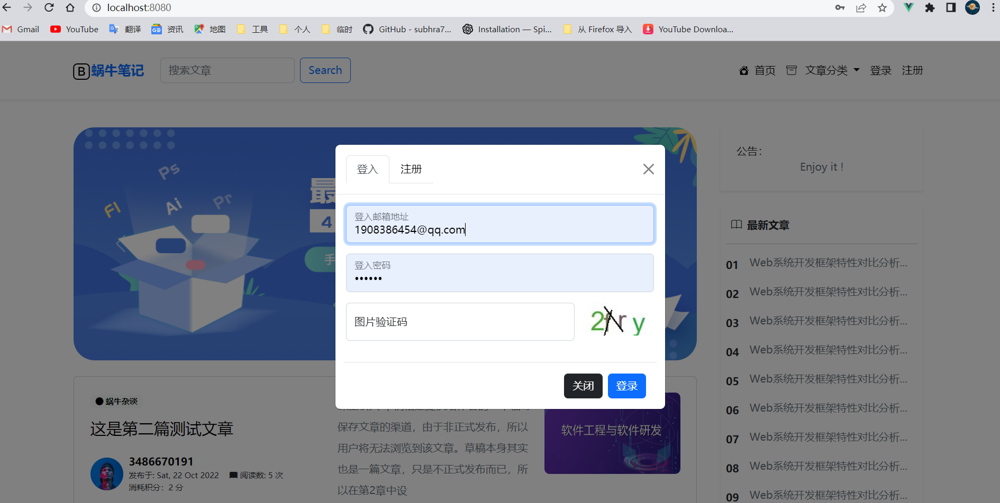
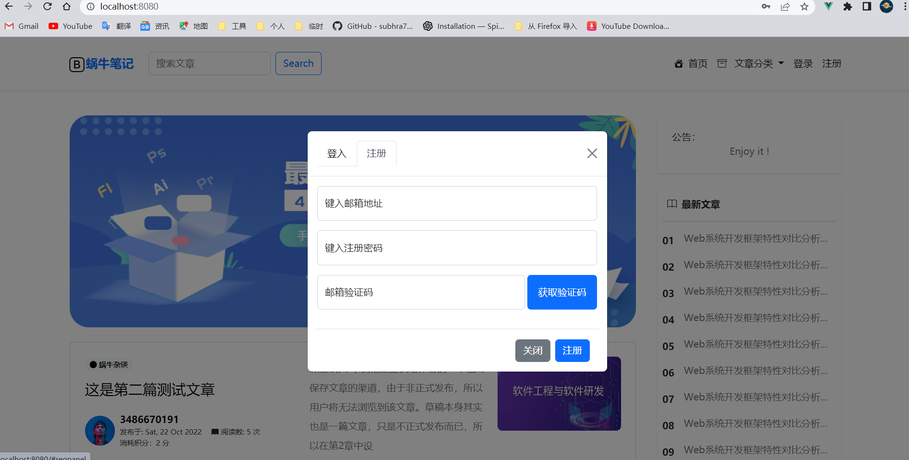
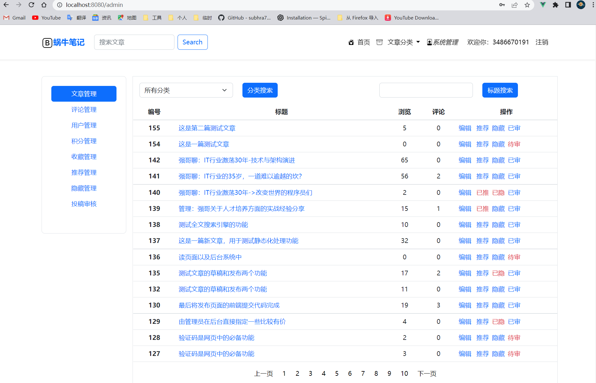
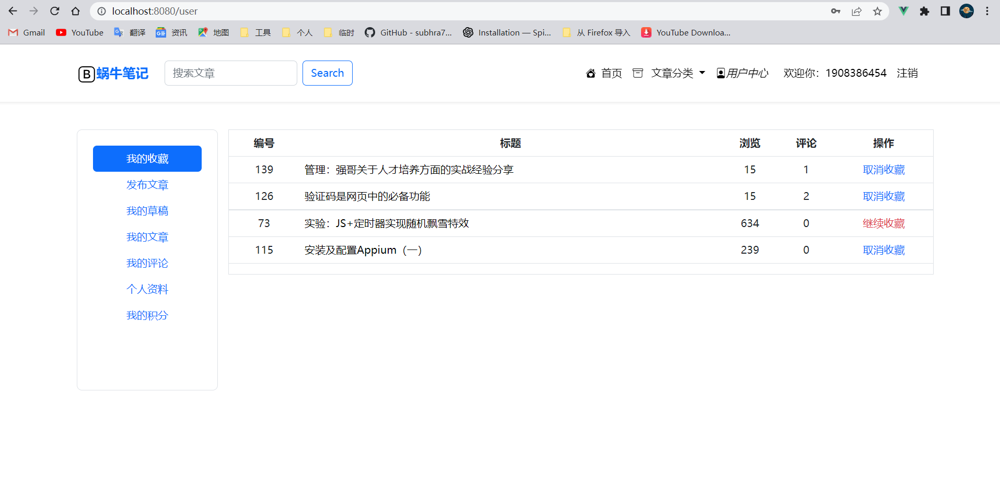
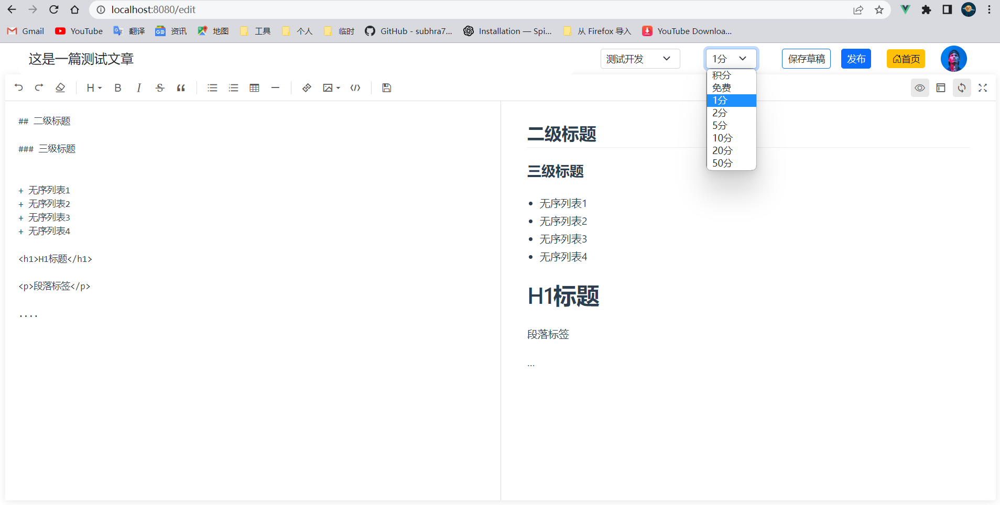
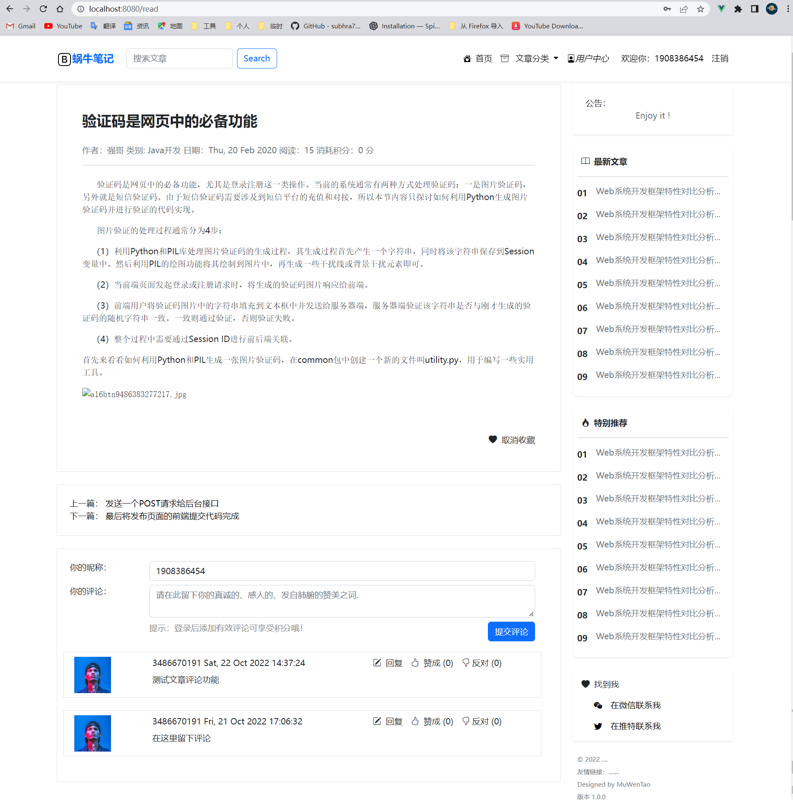

# vue-review

#### introduce

Completing a review of vue by refactoring the teacher's class projects (including refactoring page layouts and refactoring front-end and back-end separations).

## System Development Environment

- OS：

  ——Windows11

- System Architecture：

  ——BS Architecture

- DataBase：

  ——MySQL

- Tech Stack：

  ——Vue

  ——Flask

  ——Tensorflow

- Language ：

  ——Python

  ——JavaScript、HTML、CSS

## system snapshot

